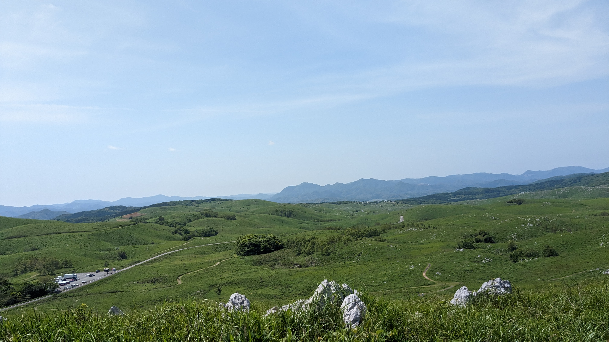

# 旅行メモ | 山口

週末に山口旅行に行ったのでメモしておく。
秋吉台ロゲが目的な旅行で、せっかくなので前日入りした。
1日目が観光で、2日目がロゲイン。

- 1日目
    - 移動（新幹線）
    - 焼肉
    - 秋芳洞
    - 秋吉台
    - 泉
    - 酒蔵
    - 宿
    - 中原中也記念館
    - 風呂
    - 飲み会
    - 散歩とほたる
- 2日目
    - ロゲイン
    - 風呂
    - ご飯
    - 移動
    - 日焼けとの戦い

## 1日目

観光の日。Google mapででてきた一番早い行程で移動して時間を作った。
いままでは学割だったので初めて新幹線のきっぷを普通の値段で買った。
それにともなって、きっぷをネットで買ったり、モバイルPasumoと紐付けることができて楽しかった。
スマホで新幹線に乗るのはすこしどきどきする。

僕と同じような思惑の人が多いのか、自由席は混み合っていた。座れない人がいて僕も危なかったが、荷物を座席においている人に声をかけて座ることに成功した。
すこしコミュニケーション取れると得する。
名古屋から一人と合流した。たまたま横の人たちが名古屋で降りたので、合流したもう一人は入れ替わりで座ることができてよかった。ついている。
名古屋が行程のちょうど真ん中くらいで、合計で4時間ほど新幹線に乗り新山口に辿り着いた。
新山口で熊本から車を運転してきてくれたもう一人と合流して、あらかじめ目星をつけておいた牧場併設のステーキハウスで早めの昼食を頂いた。

あのあたりにも地場の牛がいるみたいで少し推しているような雰囲気だった。頂いたお肉は（僕は焼肉をいただいた）やはりおいしかった。
食べ放題で舞い上がる年齢は過ぎ去ったようで、いい肉をいい感じの食べ方でいただくのが最近は幸せだと感じる。食べ放題はおいしいというより楽しい感じ。そういう幸せもあるけど。

お昼を頂いてからは、すこし離れたところにある秋芳洞にいった。行くまで記憶から抜けていたが、中学三年生のころの修学旅行で秋芳洞には行ったことがあった。
当時お土産に買った湯呑みが今も売られていて記憶が蘇った。
二回目とはいっても違う面子で訪れているし、感性も変わっているおかげで純粋に楽しめた。あそこは今行ってもまた楽しめると思う。次行くときはもう少し地学の勉強をしてから行きたい。
秋芳洞は往復することも可能だが、片道で抜けてしまうこともできて、今回は片道で地上にでることにした。地上は特に面白い感じではなかったので、特に目的がないなら往復したほうが良いだろう。

秋芳洞の入口まで帰ってから、そのあたりで売っているアイス（炭のはいった、鮮やかなアスファルトの色をしていた）を食べて、口や手を汚してから翌日訪れる秋吉台を見に行った。
秋吉台の展望台の看板で知ったのだが、秋吉台は割と下の方にある鍾乳洞で、もっと上にも２つほど名前のついた、観光で入れる鍾乳洞があるらしい。
そこからは車でカルストロードを抜けつつ（景色がとてもよかった）なんとか弁財天という、青くてきれいな泉を見に行った。
泉では軟水を汲めて、そこそこのおいしさだった。水を汲むためのペットボトルを開けるのに1L一気飲みしたからそう感じただけかもしれない。

併設されている地域のものをうっているお店で唐辛子を買って（ペペロンチーノを作りたい、ちょうど今日の昼にペペロンチーノをいただいて、ハーブを入れるとおいしいことを知った）、
宿のある湯田温泉へと移動した。

その途中で思いがけず酒蔵を見つけて覗いてみるとたまたまイベントをやっていた。おしゃれ系の酒蔵として売っているみたいで、雑誌かなにかと手を組んでいるみたいだった。
酒蔵の設備を友達に解説してもらいながらおしゃれ甘酒を飲み、日本酒と関係ないところで作られたビールを買って道に戻った。

宿は青年のなんとか、みたいな行政が一枚噛んでそうなところで特にこれといった魅力はないが欠点もなく、部屋が異様に広いことが印象的だった。
冷蔵庫にお酒をいれたものの電源を入れ忘れたまま街に繰り出した。だいたい16時すぎくらいだったか。

街には意外と見どころがたくさんあって、ザビエルのゆかりのところとか、芸術関係の施設、温泉、酒蔵や酒屋など、時間は足りなかった。
熱意と多数決によって中原中也記念館に行くことをぬるっと決めて、詩人の石碑とかを見つつ向かった。

中原中也は「よごれちまったかなしみに」くらいしか知らなかったが金曜の夜に少しだけ予習していたので楽しみだった。
行ってみると特別展として「山羊の詩」の出版にまつわることが取り上げられていて集中した。
集中しても僕は早くは文章を理解できないし、閉館まで1時間もなかったので消化不良である。もう一回くらい行きたい。
作品は韻がとても良かったし、原稿とか解説を通じて作品をつくるプロセスとかを知れた。あんなにすごい、自然な詩を書く人も試行錯誤をするのだと知ると勇気が湧く。
作品を読むだけでは沸かない感情をいだけたので、行って良かったのだろう。

18時に閉館してしまったので、それから風呂にはいった。あのあたりは温泉がたくさんあって、そのうちの一つに入った。このときは行った温泉は、そんなに温泉っぽくなくて、
次の日にロゲインの帰りに入ったほうがぬるぬるしててそれっぽかった。ロゲインの温泉は源泉かけ流しなんだとか。
夕飯は目星をつけていたところはおろか、他のところにもなかなか入れず、3人で電話をかけまくってようやくカウンター席が空いているお店に巡り会えた。
日本酒を中心としたお魚系のおいしい料理を頂いた。

いったん宿にもどって、荷物をおいてから（夕飯の前に中原中也記念館の隣の酒屋で買い物した）翌日のための買い物をしつつホタル見るために3kmくらい散歩した。
出かけるときに冷蔵庫の電源が入っていないことに気がついたが、背に腹は変えられないので室温のビールを3人で2つ回し飲みながらの散歩になってしまった。
途中のコンビニで焼きそばを補給して（一応翌日の朝ごはんとかも買って）川までたどり着くと想定外にホタルを見ることができた。
町中の川にホタルが本当にいるとは思っていなかったが、しっかり光っていた。

帰りは途中まで歩いたのだが、疲れ（と酔い？）が回っていて歩きたくない雰囲気になりタクシーに少しだけのった。
そのあとはすぐに就寝。

## 2日目

夜はよっていたわけではなく疲れていただけだったようで、みんなしっかり起きた。
いつもどおり支度を済ませてロゲイン会場の秋吉台へ。
秋吉台のロゲインも書くことがそれなりにあるけど、疲れたのでとりあえず省略。

走り終わってからはアイスを食べ、大会がもう開催されないことやその経緯に少しの悲しみを覚えつつ風呂に向かう。閉会式は時間かかる予感がしたのででなかった。
お風呂は湯田温泉まで戻り、いい感じのところでいただいた。
風呂ではゆっくりしたが、時間がないのでご飯を食べるところを急いで決めて、新山口駅へと移動。道中にある店を選んだのでそこで瓦そばと天丼をいただいた。

新山口には目標の範囲内でたどり着けて、お土産を見る時間もとれた。熊本の友達とはここで解散。
途中までは完璧だったのだが、途中で乗りたい新幹線が車両点検をして30分ほど待った。
不幸中の幸いで、路線の端の方からのったので、席には座れたが社内は混み合っていた。

名古屋でもう一人の友達と別れたあとは、新幹線のすごく硬いアイスのキャラメル味を食べた。
多分初めてあの硬いアイスを食べたと思う（もしかしたら小さい頃に親にかってもらったかもしれない）。
新横浜線に乗って家へ帰った。

秋吉台で派手に日焼けしたのを家で冷ましてから就寝。長い週末だった。

