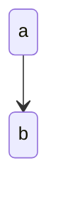

# ttのアーキテクチャ

## 目的

この文書の目的はttの開発者がアーキテクチャの意図や判断の理由を把握するのを助けることです。
裏の目的として、こういう文章を書く練習をすることもあります。

## アーキテクチャドライバ

保守性と互換性に重点を置いています。

### 保守性

ttは僕が欲しい機能をシュッと週末や平日の退勤後にシュッと実装して、日々の日記書きを便利にするためのツールです。欲しいものをシュッと作れることが存在意義であり、僕にとってHugoなど既存ツールいnくらべた差別化ポイントです。そのため保守性が必要なのです。

### 互換性

また、ttはあくまで日記を公開するサイトです。コンテンツである日記の方が重要です。そのため、僕が書く日記のフォーマットに対して互換性が必要です。既存の日記記事を捨てるつもりもなければ、新しいブログエンジンへの移行を妨げるつもりもありません。なので互換性が必要です。

### まとめ

そういうわけで、アーキテクチャの決定は保守性と互換性を十分にすることを目標にしていますし、迷ったらこれらを上げることを優先します。
そのほかに、機密性が欲しくなることもありますが、今回のスコープからは外しています。

## システム全体構成

